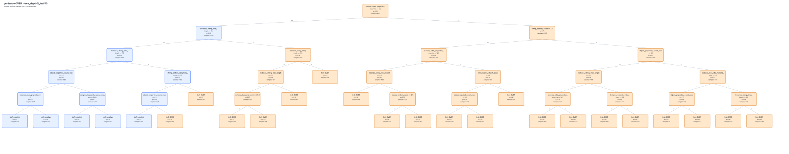

# Guidance — interprétation des règles de prédiction OVER

Ce document réorganise les règles extraites de l’arbre de décision entraîné pour prédire les cas **OVER** du framework **Guidance**.

Sources utilisées :

- `over_rules.md` : règles, métriques et arbre textuel ;
- `over_tree.svg` : représentation graphique de l’arbre ;
- `analyze_refined_features.py` : définition des features utilisées.



---

## 1. Signification correcte d’un cas OVER

Un cas **OVER** correspond à la situation suivante :

```text
instance attendue valide + instance rejetée par Guidance
```

Le framework est alors **trop restrictif** : il exclut une instance qui respecte pourtant le JSON Schema.

Ce cas ne doit pas être confondu avec **UNDER**, où le framework accepte une instance qui devrait être rejetée.

---

## 2. Performances de l’arbre retenu

| Élément | Valeur |
|---|---:|
| Arbre | `tree_depth5_leaf50` |
| Seuil de décision | `0.29` |
| F1 test | `0.793249` |
| Précision test | `0.746032` |
| Recall test | `0.846847` |
| PR-AUC test | `0.838457` |
| ROC-AUC test | `0.808367` |

L’arbre a été entraîné avec un découpage par `schema_id`. Les schémas du jeu de test ne sont donc pas présents dans le jeu d’entraînement.

---

## 3. Comment lire les métriques d’une règle

Chaque règle correspond à une **feuille de l’arbre**. Les feuilles sont mutuellement exclusives : une ligne de test ne peut atteindre qu’une seule feuille.

- **Taux positif feuille train** : proportion de cas OVER parmi les exemples d’entraînement arrivant dans cette feuille.
- **Support test** : nombre de tests du jeu de test satisfaisant la règle.
- **Précision test** : proportion de vrais cas OVER parmi les tests couverts par la règle.
- **Contribution au recall test** : proportion de l’ensemble des vrais cas OVER du jeu de test capturée par cette règle.

Une précision élevée avec un support très faible doit être lue comme un signal local. Une règle avec un support élevé décrit un profil plus fréquent.

### Pourquoi certaines feuilles affichées `class: 0` sont exportées comme règles positives

L’arbre textuel affiche la classe obtenue avec le seuil standard de `0.5`. Cependant, le pipeline utilise un seuil optimisé de :

```text
0.29
```

Une feuille ayant, par exemple, un taux positif de `0.41` est donc :

- affichée `class: 0` par l’export textuel standard ;
- considérée positive par le modèle final, car `0.41 > 0.29`.

Les règles positives doivent donc être interprétées avec le seuil `0.29`, et non avec la seule étiquette affichée dans l’arbre textuel.

---

## 4. Rappel rapide des features utilisées

Avant de lire les règles, voici un rappel très court des features mobilisées par l’arbre :

- `schema_total_properties_recursive` : nombre total de propriétés déclarées dans tous les blocs `properties` du schéma, en incluant les sous-objets parcourus récursivement.
- `string_context_count` : nombre de nœuds du schéma associés aux chaînes, par exemple un `type: string` ou un nœud contenant `pattern`, `minLength`, `maxLength` ou `format`.
- `object_properties_count_max` : plus grand nombre de propriétés déclarées dans un même objet du schéma.
- `object_context_count` : nombre total de nœuds du schéma considérés comme des contextes objet.
- `object_required_count_max` : plus grand nombre de propriétés déclarées dans un même tableau `required`.
- `schema_keyword_count` : nombre total de mots-clés rencontrés dans tous les nœuds du schéma.
- `string_pattern_complexity_score` : score heuristique résumant la longueur et certains opérateurs des expressions régulières utilisées dans les contraintes `pattern`.
- `instance_string_total_length` : somme des longueurs de toutes les valeurs textuelles présentes dans l’instance.
- `instance_string_max_length` : longueur de la plus longue valeur textuelle de l’instance.
- `instance_numeric_value_count` : nombre total de valeurs numériques présentes dans l’instance, entiers et nombres décimaux inclus, booléens exclus.
- `instance_max_abs_numeric_value` : plus grande valeur absolue parmi toutes les valeurs numériques de l’instance.
- `array_nested_object_count` : nombre d’objets de l’instance directement contenus dans un tableau.

## 5. Résumé opérationnel de l’arbre

Après regroupement des feuilles qui conduisent toutes à une prédiction positive avec le seuil `0.29`, la logique de l’arbre peut être résumée par trois profils.

```text
Guidance prédit OVER si :

1. schema_total_properties_recursive >= 9

OU

2. schema_total_properties_recursive <= 8
   ET instance_string_total_length >= 105

OU

3. schema_total_properties_recursive <= 8
   ET 18 <= instance_string_total_length <= 104
   ET (
        string_pattern_complexity_score >= 62
        OU object_properties_count_max >= 7
   )
```

Cette forme résumée est plus fidèle à la décision finale du modèle que la présentation des 20 feuilles comme 20 causes indépendantes.

---

## 6. Vue synthétique des trois profils

Les métriques agrégées ci-dessous sont approximatives, car elles sont calculées à partir des métriques de feuilles déjà arrondies.

| Profil | Règles regroupées | Support test | Précision agrégée approximative | Contribution au recall |
|---|---|---:|---:|---:|
| Schémas contenant au moins 9 propriétés déclarées récursivement | 1–9, 11, 15, 16, 18, 19 | 499 | ≈ 0.778 | 0.699 |
| Petits schémas avec une instance textuelle longue | 10, 12, 14, 20 | 89 | ≈ 0.652 | 0.104 |
| Petits schémas avec texte intermédiaire et pattern complexe ou objet large | 13, 17 | 42 | ≈ 0.572 | 0.043 |

Ces trois profils couvrent ensemble environ :

```text
0.699 + 0.104 + 0.043 = 0.846
```

du recall test, ce qui correspond au recall global de l’arbre à l’arrondi près.

---

## 7. Profil A — schémas contenant au moins 9 propriétés

## Règle générale

```text
schema_total_properties_recursive >= 9
```

Toutes les feuilles situées sous cette branche dépassent le seuil de décision `0.29`. Dans cet arbre, la présence d’au moins neuf propriétés déclarées dans l’ensemble du schéma constitue donc le principal signal de prédiction OVER.

Cette feature ne signifie pas nécessairement qu’un seul objet contient neuf propriétés. Elle additionne récursivement les propriétés déclarées dans tous les sous-objets du schéma.

## Interprétation

L’arbre associe les schémas comportant plusieurs propriétés et sous-objets à un risque plus élevé que Guidance rejette une instance pourtant valide. Les subdivisions suivantes ne changent pas la prédiction finale ; elles différencient principalement le niveau de précision observé dans chaque sous-région.

---

## 7.1 Schémas riches en contextes string

Condition commune :

```text
schema_total_properties_recursive >= 9
AND string_context_count >= 8
```

Règles concernées : **1 à 7 et 15**.

| Sous-profil | Règles | Support | Précision approximative | Recall |
|---|---|---:|---:|---:|
| Objet très large : au moins 17 propriétés dans un même objet | 1–4 | 76 | 1.000 | 0.137 |
| Objet de largeur maximale 16 et chaîne individuelle longue | 5–6 | 112 | ≈ 0.893 | 0.181 |
| Objet de largeur maximale 16 et chaînes plus courtes | 7 et 15 | 157 | ≈ 0.688 | 0.194 |

### Interprétation du sous-profil le plus fort

Les règles 1 à 4 partagent la condition essentielle suivante :

```text
schema_total_properties_recursive >= 9
AND string_context_count >= 8
AND object_properties_count_max >= 17
```

Les divisions supplémentaires sur les valeurs numériques, la longueur totale des chaînes et le seuil de 22 propriétés servent à répartir ces cas entre plusieurs feuilles. Sur le jeu de test, les quatre feuilles ont toutes une précision de `1.000`.

### Exemple réel

- `schema_id` : `Github_medium---o29942.json`
- `test_id` : `Github_medium---o29942.json::test_00000`
- `test_index` : `0`
- Instance attendue valide : `expected_validity = valid`
- Résultat Guidance : `actual_result = failed`, `outlines_result = rejected`
- Validateur de référence : `valid`
- Élément du schéma illustrant le profil : un objet `aaasession` avec `18` propriétés déclarées, dont `11` contextes string.

Valeurs exactes des features de la règle :

| Feature | Valeur |
|---|---:|
| `schema_total_properties_recursive` | `18` |
| `string_context_count` | `11` |
| `object_properties_count_max` | `18` |
| `instance_string_total_length` | `70` |
| `instance_string_max_length` | `19` |
| `instance_numeric_value_count` | `1` |
| `instance_max_abs_numeric_value` | `1.0` |

JSON Schema complet :

```json
{
  "properties": {
    "all": { "type": "boolean" },
    "destip": { "readonly": true, "type": "string" },
    "destport": { "readonly": true, "type": "integer" },
    "groupname": { "type": "string" },
    "iip": { "type": "string" },
    "intranetip": { "readonly": true, "type": "string" },
    "intranetip6": { "readonly": true, "type": "string" },
    "ipaddress": { "readonly": true, "type": "string" },
    "netmask": { "type": "string" },
    "nodeid": { "type": "integer" },
    "peid": { "readonly": true, "type": "integer" },
    "port": { "readonly": true, "type": "integer" },
    "privateip": { "readonly": true, "type": "string" },
    "privateport": { "readonly": true, "type": "integer" },
    "publicip": { "readonly": true, "type": "string" },
    "publicport": { "readonly": true, "type": "integer" },
    "sessionkey": { "type": "string" },
    "username": { "type": "string" }
  },
  "title": "aaasession",
  "type": "object"
}
```

Instance complète :

```json
{
  "all": true,
  "groupname": "example_group",
  "iip": "192.168.1.100",
  "netmask": "255.255.255.0",
  "nodeid": 1,
  "sessionkey": "example_session_key",
  "username": "example_user"
}
```

Lecture prudente : l’exemple est valide car le schéma ne déclare ni `required` ni `additionalProperties: false`; l’objet peut donc contenir seulement une partie des propriétés déclarées. Le profil prédictif vient surtout du nombre élevé de propriétés et de contextes string. La cause technique exacte du rejet par Guidance reste à confirmer par réduction du schéma.

---

## 7.2 Schémas avec peu de contextes string

Condition commune :

```text
schema_total_properties_recursive >= 9
AND string_context_count <= 7
```

Règles concernées : **8, 9, 11, 16, 18 et 19**.

Deux sous-profils apparaissent.

### Entre 9 et 12 propriétés récursives

```text
9 <= schema_total_properties_recursive <= 12
```

Règles : **9, 11 et 16**.

Les sous-divisions utilisent :

- la longueur de la plus longue chaîne de l’instance ;
- le nombre de contextes objet du schéma.

Les trois feuilles dépassent le seuil `0.29`. Leur support cumulé est de 84 tests, pour une précision agrégée approximative de `0.726`.

### Au moins 13 propriétés récursives

```text
schema_total_properties_recursive >= 13
```

Règles : **8, 18 et 19**.

Les subdivisions utilisent :

- `array_nested_object_count` ;
- `object_required_count_max`.

Ces trois branches sont également prédites OVER. Elles semblent surtout ajuster la probabilité associée aux schémas contenant des objets obligatoires ou des objets placés dans des tableaux.

### Exemples réels

#### Exemple 7.2.a — entre 9 et 12 propriétés récursives

- `schema_id` : `Github_easy---o58492.json`
- `test_id` : `Github_easy---o58492.json::test_00002`
- `test_index` : `2`
- Instance attendue valide : `expected_validity = valid`
- Résultat Guidance : `actual_result = failed`, `outlines_result = rejected`
- Validateur de référence : `valid`
- Structure concernée : objet `Say step` avec `9` propriétés, dont `5` propriétés obligatoires.

Valeurs exactes :

| Feature | Valeur |
|---|---:|
| `schema_total_properties_recursive` | `9` |
| `string_context_count` | `6` |
| `object_context_count` | `2` |
| `object_required_count_max` | `5` |
| `array_nested_object_count` | `0` |
| `instance_string_total_length` | `62` |
| `instance_string_max_length` | `19` |

JSON Schema complet :

```json
{
  "$schema": "http://json-schema.org/draft-04/schema#",
  "title": "Say step",
  "type": "object",
  "properties": {
    "name": { "type": "string" },
    "kind": { "enum": ["say"] },
    "label": { "type": "string" },
    "title": { "type": "string" },
    "phrase": { "type": "string" },
    "voice": { "type": "string" },
    "language": { "type": "string" },
    "loop": { "type": "integer" },
    "iface": { "type": "object" }
  },
  "required": ["name", "kind", "label", "title", "phrase"]
}
```

Instance complète :

```json
{
  "name": "Greeting",
  "kind": "say",
  "label": "Welcome",
  "title": "Introduction",
  "phrase": "Hello, how are you?",
  "voice": "Female",
  "language": "English",
  "loop": 1,
  "iface": {}
}
```

#### Exemple 7.2.b — au moins 13 propriétés récursives

- `schema_id` : `Github_medium---o69522.json`
- `test_id` : `Github_medium---o69522.json::test_00002`
- `test_index` : `2`
- Instance attendue valide : `expected_validity = valid`
- Résultat Guidance : `actual_result = failed`, `outlines_result = rejected`
- Validateur de référence : `valid`
- Structure concernée : objet produit avec sous-objet `address` et sous-objet imbriqué `state`.

Valeurs exactes :

| Feature | Valeur |
|---|---:|
| `schema_total_properties_recursive` | `13` |
| `string_context_count` | `7` |
| `object_context_count` | `3` |
| `object_required_count_max` | `4` |
| `array_nested_object_count` | `0` |
| `instance_string_total_length` | `88` |
| `instance_numeric_value_count` | `5` |

JSON Schema complet :

```json
{
  "$schema": "http://json-schema.org/draft-04/schema#",
  "type": "object",
  "properties": {
    "id": { "type": "string" },
    "name": { "type": "string" },
    "price": { "type": "number" },
    "tags": { "type": "array" },
    "vector": { "type": "array" },
    "address": {
      "type": "object",
      "properties": {
        "street": { "type": "string" },
        "number": { "type": "number" },
        "zip_code": { "type": "string" },
        "state": {
          "type": "object",
          "properties": {
            "name": { "type": "string" },
            "code": { "type": "string" }
          }
        },
        "country": {
          "type": "string",
          "enum": ["Czech Republic", "United States of America"]
        }
      },
      "required": ["street", "number", "zip_code", "country"]
    }
  },
  "required": ["id"]
}
```

Instance complète :

```json
{
  "id": "product-123",
  "name": "Example Product",
  "price": 19.99,
  "tags": ["tag1", "tag2", "tag3"],
  "vector": [1.0, 2.0, 3.0],
  "address": {
    "street": "Main Street",
    "number": 123,
    "zip_code": "12345",
    "state": {
      "name": "New York",
      "code": "NY"
    },
    "country": "United States of America"
  }
}
```

Lecture prudente : dans les deux exemples, l’instance est valide selon le validateur de référence. Les exemples illustrent la région de l’arbre `schema_total_properties_recursive >= 9` et `string_context_count <= 7`, mais ils ne prouvent pas à eux seuls la cause technique du rejet Guidance.

---

## 8. Profil B — petit schéma et volume textuel élevé

## Règle générale

```text
schema_total_properties_recursive <= 8
AND instance_string_total_length >= 105
```

Règles concernées : **10, 12, 14 et 20**.

Les quatre feuilles issues de cette région sont positives avec le seuil `0.29`.

## Interprétation

Ici, le schéma possède peu de propriétés déclarées, mais l’instance contient un volume textuel important. La séparation entre :

- une longueur totale comprise entre 105 et 196 ;
- une longueur totale d’au moins 197 ;
- une grande chaîne individuelle ;
- un nombre plus ou moins élevé de mots-clés dans le schéma ;

sert principalement à ajuster la probabilité estimée.

La décision finale peut être résumée par la présence d’au moins 105 caractères cumulés dans les valeurs string de l’instance.

### Exemple réel

- `schema_id` : `Github_easy---o6244.json`
- `test_id` : `Github_easy---o6244.json::test_00004`
- `test_index` : `4`
- Instance attendue valide : `expected_validity = valid`
- Résultat Guidance : `actual_result = failed`, `outlines_result = rejected`
- Validateur de référence : `valid`
- Longueur totale des chaînes : `105`
- Plus longue chaîne : `76`

Valeurs exactes :

| Feature | Valeur |
|---|---:|
| `schema_total_properties_recursive` | `3` |
| `schema_keyword_count` | `13` |
| `instance_string_total_length` | `105` |
| `instance_string_max_length` | `76` |
| `object_properties_count_max` | `3` |
| `string_pattern_complexity_score` | `0` |

JSON Schema complet :

```json
{
  "$schema": "http://json-schema.org/draft-04/schema#",
  "additionalProperties": false,
  "type": "object",
  "properties": {
    "level": {
      "title": "Level",
      "enum": ["info", "warning", "error", "critical"]
    },
    "subjectTemplate": {
      "title": "Subject Template",
      "type": "string",
      "minLength": 1
    },
    "messageTemplate": {
      "title": "Message Template",
      "type": "string",
      "minLength": 1
    }
  },
  "required": ["level", "subjectTemplate", "messageTemplate"]
}
```

Instance complète :

```json
{
  "level": "error",
  "subjectTemplate": "Error occurred in system",
  "messageTemplate": "An error occurred in the system, please check the logs for more information."
}
```

Lecture prudente : l’instance respecte l’énumération de `level`, contient les trois propriétés obligatoires et satisfait les longueurs minimales. Elle illustre bien le profil « petit schéma + volume textuel élevé ». Le rejet par Guidance reste à investiguer techniquement.

---

## 9. Profil C — petit schéma, texte intermédiaire et structure textuelle ou objet plus riche

## Règle générale

```text
schema_total_properties_recursive <= 8
AND 18 <= instance_string_total_length <= 104
AND (
     string_pattern_complexity_score >= 62
     OR object_properties_count_max >= 7
)
```

Règles concernées : **13 et 17**.

## Interprétation

Dans cette région, la longueur textuelle de l’instance n’est ni très faible ni très élevée. La prédiction OVER dépend alors de l’un des deux signaux suivants :

1. les contraintes `pattern` du schéma obtiennent un score heuristique cumulé d’au moins 62 ;
2. un objet du schéma déclare au moins sept propriétés.

Le score `string_pattern_complexity_score` est calculé au niveau du schéma à partir de la longueur des regex et de certains caractères comme `|`, `*`, `+`, `?`, `[` et `(`.

### Exemples réels

#### Exemple 9.a — pattern complexe

- `schema_id` : `Github_trivial---o67212.json`
- `test_id` : `Github_trivial---o67212.json::test_00000`
- `test_index` : `0`
- Instance attendue valide : `expected_validity = valid`
- Résultat Guidance : `actual_result = failed`, `outlines_result = rejected`
- Validateur de référence : `valid`
- Pattern concerné : regex d’URL `"(https?://([-\\w\\.]+)+(:\\d+)?(/([\\w/_\\.]*(\\?\\S+)?)?)?)"`

Valeurs exactes :

| Feature | Valeur |
|---|---:|
| `schema_total_properties_recursive` | `0` |
| `instance_string_total_length` | `56` |
| `string_pattern_complexity_score` | `91` |
| `object_properties_count_max` | `0` |
| `string_context_count` | `1` |

JSON Schema complet :

```json
{
  "_description": "The patter is taken from https://mathiasbynens.be/demo/url-regex. @diegoperini version",
  "pattern": "(https?://([-\\w\\.]+)+(:\\d+)?(/([\\w/_\\.]*(\\?\\S+)?)?)?)",
  "type": "string"
}
```

Instance complète :

```json
"https://www.example.com/path/to/resource?query=parameter"
```

#### Exemple 9.b — objet large dans un petit schéma

- `schema_id` : `Github_easy---o28269.json`
- `test_id` : `Github_easy---o28269.json::test_00000`
- `test_index` : `0`
- Instance attendue valide : `expected_validity = valid`
- Résultat Guidance : `actual_result = failed`, `outlines_result = rejected`
- Validateur de référence : `valid`
- Objet concerné : objet `uri` avec `7` propriétés déclarées.

Valeurs exactes :

| Feature | Valeur |
|---|---:|
| `schema_total_properties_recursive` | `7` |
| `instance_string_total_length` | `61` |
| `string_pattern_complexity_score` | `0` |
| `object_properties_count_max` | `7` |
| `string_context_count` | `6` |
| `instance_numeric_value_count` | `1` |

JSON Schema complet :

```json
{
  "additionalProperties": false,
  "description": "",
  "properties": {
    "fragment": { "type": "string" },
    "host": { "format": "hostname", "type": "string" },
    "path": { "type": "string" },
    "port": { "minimum": 0, "type": "integer" },
    "query": { "type": "string" },
    "scheme": { "type": "string" },
    "userinfo": { "type": "string" }
  },
  "title": "uri",
  "type": "object"
}
```

Instance complète :

```json
{
  "fragment": "anchor",
  "host": "example.com",
  "path": "/path/to/resource",
  "port": 8080,
  "query": "key=value",
  "scheme": "https",
  "userinfo": "user:password"
}
```

Lecture prudente : le premier exemple illustre le signal `string_pattern_complexity_score >= 62`, tandis que le second illustre `object_properties_count_max >= 7`. Dans les deux cas, l’instance est valide selon le validateur de référence et rejetée par Guidance ; la contrainte technique exacte responsable du rejet doit être confirmée par une analyse ciblée.

---

## 10. Tableau détaillé des 20 feuilles

Les conditions ci-dessous sont simplifiées en supprimant les seuils redondants hérités du chemin de l’arbre.

| Règle | Condition simplifiée | Taux train | Support | Précision | Recall | Niveau |
|---:|---|---:|---:|---:|---:|---|
| 1 | propriétés totales ≥ 9 ; contextes string ≥ 8 ; largeur objet ≥ 17 ; max absolu numérique > 1,5 ; longueur textuelle totale ≥ 120 | 0.978 | 46 | 1.000 | 0.083 | Très élevé |
| 2 | propriétés totales ≥ 9 ; contextes string ≥ 8 ; largeur objet ≥ 22 ; max absolu numérique ≤ 1,5 | 0.938 | 13 | 1.000 | 0.023 | Très élevé |
| 3 | propriétés totales ≥ 9 ; contextes string ≥ 8 ; largeur objet ≥ 17 ; max absolu numérique > 1,5 ; longueur textuelle totale ≤ 119 | 0.875 | 12 | 1.000 | 0.022 | Très élevé |
| 4 | propriétés totales ≥ 9 ; contextes string ≥ 8 ; largeur objet entre 17 et 21 ; max absolu numérique ≤ 1,5 | 0.736 | 5 | 1.000 | 0.009 | Très élevé, support faible |
| 5 | propriétés totales ≥ 9 ; contextes string ≥ 8 ; largeur objet ≤ 16 ; chaîne maximale ≥ 35 ; au moins 4 nombres | 0.969 | 34 | 0.941 | 0.058 | Très élevé |
| 6 | propriétés totales ≥ 9 ; contextes string ≥ 8 ; largeur objet ≤ 16 ; chaîne maximale ≥ 35 ; au plus 3 nombres | 0.826 | 78 | 0.872 | 0.123 | Élevé |
| 7 | propriétés totales ≥ 31 ; contextes string ≥ 8 ; largeur objet ≤ 16 ; chaîne maximale ≤ 34 | 0.901 | 46 | 0.826 | 0.068 | Élevé |
| 8 | propriétés totales ≥ 13 ; contextes string ≤ 7 ; au plus 3 objets directement dans des tableaux ; required maximal ≤ 6 | 0.830 | 32 | 0.812 | 0.047 | Élevé |
| 9 | propriétés totales entre 9 et 12 ; contextes string ≤ 7 ; chaîne maximale ≥ 13 ; au plus 2 contextes objet | 0.412 | 24 | 0.792 | 0.034 | Élevé |
| 10 | propriétés totales ≤ 8 ; longueur textuelle totale ≥ 197 | 0.821 | 32 | 0.750 | 0.043 | Élevé |
| 11 | propriétés totales entre 9 et 12 ; contextes string ≤ 7 ; chaîne maximale ≥ 13 ; au moins 3 contextes objet | 0.674 | 47 | 0.723 | 0.061 | Modéré |
| 12 | propriétés totales ≤ 8 ; longueur textuelle totale entre 105 et 196 ; chaîne maximale ≥ 44 | 0.690 | 27 | 0.704 | 0.034 | Modéré |
| 13 | propriétés totales ≤ 8 ; longueur textuelle totale entre 18 et 104 ; score des patterns ≥ 62 | 0.567 | 14 | 0.643 | 0.016 | Modéré, support faible |
| 14 | propriétés totales ≤ 8 ; longueur textuelle totale entre 105 et 196 ; chaîne maximale ≤ 43 ; au moins 24 mots-clés de schéma | 0.488 | 11 | 0.636 | 0.013 | Modéré, support faible |
| 15 | propriétés totales entre 9 et 30 ; contextes string ≥ 8 ; largeur objet ≤ 16 ; chaîne maximale ≤ 34 | 0.652 | 111 | 0.631 | 0.126 | Modéré, support élevé |
| 16 | propriétés totales entre 9 et 12 ; contextes string ≤ 7 ; chaîne maximale ≤ 12 | 0.299 | 13 | 0.615 | 0.014 | Modéré, proche du seuil |
| 17 | propriétés totales ≤ 8 ; longueur textuelle totale entre 18 et 104 ; score des patterns ≤ 61 ; largeur objet ≥ 7 | 0.445 | 28 | 0.536 | 0.027 | Exploratoire |
| 18 | propriétés totales ≥ 13 ; contextes string ≤ 7 ; au moins 4 objets directement dans des tableaux | 0.408 | 15 | 0.467 | 0.013 | Exploratoire |
| 19 | propriétés totales ≥ 13 ; contextes string ≤ 7 ; au plus 3 objets directement dans des tableaux ; required maximal ≥ 7 | 0.538 | 23 | 0.435 | 0.018 | Exploratoire |
| 20 | propriétés totales ≤ 8 ; longueur textuelle totale entre 105 et 196 ; chaîne maximale ≤ 43 ; au plus 23 mots-clés de schéma | 0.310 | 19 | 0.421 | 0.014 | Exploratoire, proche du seuil |

---

## 11. Interprétation globale

## 11.1 Le signal principal est la taille récursive du schéma

La racine de l’arbre utilise :

```text
schema_total_properties_recursive <= 8.5
```

Avec le seuil final de `0.29`, toutes les feuilles de la branche :

```text
schema_total_properties_recursive >= 9
```

sont prédites OVER.

Cette feature domine donc la décision finale de cet arbre.

## 11.2 Les chaînes jouent surtout un rôle pour les petits schémas

Lorsque le schéma contient au plus huit propriétés récursives, l’arbre s’appuie principalement sur :

- `instance_string_total_length` ;
- `instance_string_max_length` ;
- `string_pattern_complexity_score`.

Pour ces petits schémas, un volume textuel important constitue le signal principal.

## 11.3 Les subdivisions décrivent des niveaux de confiance

Les seuils sur :

- la largeur maximale d’un objet ;
- la quantité de valeurs numériques ;
- la valeur numérique absolue maximale ;
- le nombre d’objets dans des tableaux ;
- le nombre maximal de propriétés `required` ;

ne créent pas toujours une nouvelle décision. Dans plusieurs branches, les deux côtés d’un split restent positifs avec le seuil `0.29`. Ils servent alors principalement à distinguer des feuilles ayant des précisions différentes.

## 11.4 Nature de l’interprétation

Les règles décrivent des **associations prédictives** observées dans les données. Elles indiquent les régions dans lesquelles le modèle reconnaît plus souvent un cas OVER.

Elles ne démontrent pas que :

- le nombre de propriétés ;
- la longueur des chaînes ;
- la présence de valeurs numériques ;
- ou la complexité des patterns ;

est, à lui seul, la cause technique du rejet par Guidance.

L’identification d’une cause nécessite ensuite l’examen des schémas concernés, des instances valides rejetées et, si possible, une réduction ou une mutation contrôlée du schéma.

---

## 12. Définitions des features présentes dans l’arbre

| Feature | Niveau | Définition |
|---|---|---|
| `schema_total_properties_recursive` | Schéma | Somme du nombre de propriétés déclarées dans tous les blocs `properties` du schéma, en descendant récursivement dans les sous-schémas. |
| `string_context_count` | Schéma | Nombre de nœuds associés aux chaînes : nœud de type `string` ou contenant `pattern`, `minLength`, `maxLength` ou `format`. |
| `object_properties_count_max` | Schéma | Plus grand nombre de propriétés déclarées dans un seul bloc `properties`. |
| `object_context_count` | Schéma | Nombre de nœuds considérés comme des contextes objet. |
| `object_required_count_max` | Schéma | Plus grande taille d’un tableau `required` dans un même contexte objet. |
| `schema_keyword_count` | Schéma | Somme du nombre de clés de schéma rencontrées dans les nœuds parcourus récursivement. |
| `string_pattern_complexity_score` | Schéma | Somme d’un score heuristique appliqué aux contraintes `pattern`, fondé sur la longueur des regex et certains opérateurs. |
| `instance_string_total_length` | Instance | Somme des longueurs de toutes les valeurs string de l’instance, à tous les niveaux. |
| `instance_string_max_length` | Instance | Longueur de la plus longue valeur string de l’instance. |
| `instance_numeric_value_count` | Instance | Nombre total d’entiers et de nombres décimaux présents récursivement dans l’instance, booléens exclus. |
| `instance_max_abs_numeric_value` | Instance | Plus grande valeur absolue parmi les nombres présents dans l’instance. La valeur peut être décimale ; le seuil `1.5` ne doit donc pas être automatiquement arrondi à 2. |
| `array_nested_object_count` | Instance | Nombre d’objets de l’instance dont le parent direct est un tableau. |

## Signification de « récursivement »

Un calcul récursif commence à la racine, entre dans chaque objet, tableau ou sous-schéma, puis répète la même opération à chaque niveau jusqu’aux éléments terminaux.

Exemple :

```json
{
  "properties": {
    "user": {
      "properties": {
        "name": {},
        "age": {}
      }
    },
    "active": {}
  }
}
```

Le bloc racine déclare deux propriétés (`user`, `active`) et le sous-objet `user` en déclare deux (`name`, `age`) :

```text
schema_total_properties_recursive = 2 + 2 = 4
```

---

## 13. Traçabilité de la recherche d’exemples

Les exemples ajoutés dans les profils A, B et C ont été cherchés dans :

```text
extension_jsonschemabench/coverage_prediction/modeles_predictifs/guidance/modeling/over_dataset.csv
```

Les schémas et instances complets proviennent des fichiers :

```text
maskbench/data/<schema_id>
```

Critères appliqués :

1. `failure_type == "OVER"` ;
2. `expected_validity == "valid"` ;
3. résultat Guidance rejeté : `actual_result = failed`, `outlines_result = rejected` ;
4. correspondance avec les conditions du profil concerné ;
5. validation de l’instance avec le validateur de référence `jsonschema`.

Exemples retenus :

| Profil | `schema_id` | `test_index` | Rôle illustré |
|---|---|---:|---|
| A1 | `Github_medium---o29942.json` | `0` | schéma riche en propriétés et contextes string |
| A2.a | `Github_easy---o58492.json` | `2` | branche `9 <= schema_total_properties_recursive <= 12` |
| A2.b | `Github_medium---o69522.json` | `2` | branche `schema_total_properties_recursive >= 13` |
| B | `Github_easy---o6244.json` | `4` | petit schéma avec volume textuel élevé |
| C.a | `Github_trivial---o67212.json` | `0` | petit schéma avec regex complexe |
| C.b | `Github_easy---o28269.json` | `0` | petit schéma avec objet de largeur `7` |

Ces exemples sont des **illustrations empiriques des profils prédictifs**. Ils ne constituent pas, à eux seuls, une preuve causale de la raison technique du rejet par Guidance.
